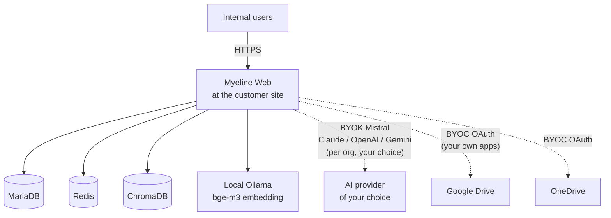

# Sovereign-hybrid edition (BYOK)

The **Sovereign-hybrid** edition is built for organisations that
want the infrastructure isolation of pure sovereign mode, without
sacrificing the quality of frontier LLMs (Mistral Large, Claude
Sonnet 4.6, GPT-5, Gemini 2.5).

It's the trade-off: **your data stays on your infrastructure**, but
**AI synthesis calls can go out** to external APIs **that you
configure yourself** (BYOK — Bring Your Own Key).

## Architecture



## Differences vs pure sovereign

| Feature                    | Sovereign           | Sovereign-hybrid           |
|----------------------------|---------------------|----------------------------|
| Local Ollama               | ✅                  | ✅                         |
| External API (Mistral, etc.) | ❌                | ✅ (BYOK per org)          |
| Google Drive / OneDrive / Dropbox connectors | ❌ | ✅ (BYOC — your OAuth apps) |
| Notion / Zotero connector  | ❌                  | ✅                         |
| Stripe                     | ❌                  | ❌                         |
| Local audit log            | ✅                  | ✅                         |
| Off-host backup (S3 / rclone) | To internal infra | To internal MinIO or S3 cloud |

## BYOK — Bring Your Own Key

In sovereign-hybrid mode, **each Enterprise organisation** within
your deployment can independently choose its LLM provider via
`/admin/orgs/<slug>`:

- **Local Ollama** (default, free)
- **Mistral AI** (your key)
- **Anthropic Claude** (your key)
- **OpenAI** (your key)
- **Google Gemini** (your key)

Keys are stored **encrypted** in the DB (`org.ai_api_key_enc` via
Fernet, derived from `CLOUD_TOKEN_KEY`). No shared "platform" key —
each org pays the provider directly.

## BYOC — Bring Your Own Credentials { #byoc }

To enable cloud connectors (Google Drive, OneDrive, Dropbox, kDrive)
in sovereign-hybrid, you must **register your own OAuth apps** with
each provider. Myeline.io credentials only work for the central SaaS.

**Why?** Your internal users access Myeline via
`https://myeline.acme.local/...`, so the OAuth redirect URI is
`https://myeline.acme.local/user/cloud/gdrive/callback`. Google /
Microsoft / Dropbox check the redirect URI against the OAuth app's
whitelist — central Myeline does not have your URL in its whitelist
(and we cannot add it at scale for security and scalability reasons).

See the detailed walkthrough:
[Sovereign-hybrid installation § BYOC](../install/sovereign-hybrid.md#byoc).

## For whom?

- Companies that want a **pragmatic trade-off** between sovereignty
  and AI synthesis quality
- Organisations that already have Anthropic / OpenAI / Mistral
  Enterprise contracts and want to use them through Myeline
- Consulting firms or law firms that host Myeline themselves for
  their clients and bill a margin on AI
- Universities / labs that want to index their Workspace Drive but
  keep the database on their internal compute cluster

## Pricing model

- **Annual licence** (quoted, 12 months max)
- You pay the **AI providers directly** for the ones you enable
  (Mistral La Plateforme, Anthropic Console, OpenAI, Google AI Studio)
- No hidden margin on our side — you see your AI costs directly
- Support included — detailed terms in the licence contract

## Getting started

```bash
git clone -b synapse git@github.com:ClaraVnk/myeline.git
cd myeline
./scripts/install.sh
# → Choose option 3 (Sovereign-hybrid installation)
# → Paste the licence key
# → The wizard explicitly asks for BYOC OAuth credentials
```

Full walkthrough: [Sovereign-hybrid installation](../install/sovereign-hybrid.md).
