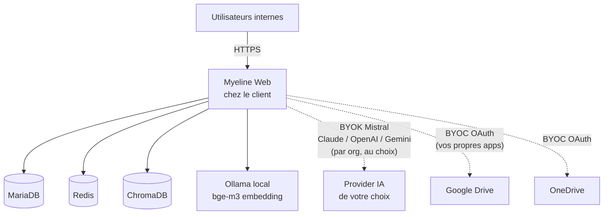

# Édition Souverain-hybride (BYOK)

L'édition **Souverain-hybride** est conçue pour les organisations
qui veulent l'isolation infrastructure du souverain pur, mais sans
sacrifier la qualité des frontier LLMs (Mistral Large, Claude
Sonnet 4.6, GPT-5, Gemini 2.5).

C'est le compromis : **vos données restent sur votre infra**, mais
**les appels de synthèse IA peuvent sortir** vers des APIs externes
**que vous configurez vous-même** (BYOK — Bring Your Own Key).

## Architecture



## Différences avec souverain pur

| Fonctionnalité           | Souverain          | Souverain-hybride          |
|--------------------------|--------------------|----------------------------|
| Ollama local             | ✅                 | ✅                         |
| API externe (Mistral, etc.) | ❌              | ✅ (BYOK par org)          |
| Connecteurs Google Drive / OneDrive / Dropbox | ❌ | ✅ (BYOC — vos OAuth apps) |
| Connecteur Notion / Zotero | ❌               | ✅                         |
| Stripe                   | ❌                 | ❌                         |
| Audit log local          | ✅                 | ✅                         |
| Backup off-host (S3 / rclone) | Vers infra interne | Vers MinIO ou S3 cloud |

## BYOK — Bring Your Own Key

En souverain-hybride, **chaque organisation Enterprise** au sein de
votre déploiement peut choisir indépendamment son provider LLM via
`/admin/orgs/<slug>` :

- **Local Ollama** (par défaut, gratuit)
- **Mistral AI** (votre clé)
- **Anthropic Claude** (votre clé)
- **OpenAI** (votre clé)
- **Google Gemini** (votre clé)

Les clés sont stockées **chiffrées** dans la DB
(`org.ai_api_key_enc` via Fernet, dérivée de `CLOUD_TOKEN_KEY`).
Aucune clé "platform" partagée — chaque org paie son provider en
direct.

## BYOC — Bring Your Own Credentials { #byoc }

Pour activer les connecteurs cloud (Google Drive, OneDrive, Dropbox,
kDrive) en souverain-hybride, vous devez **enregistrer vos propres
apps OAuth** chez chaque provider. Les credentials de myeline.io ne
fonctionnent que pour le SaaS central.

**Pourquoi ?** Vos utilisateurs internes accèdent à Myeline via
`https://myeline.acme.local/...`, donc le redirect URI OAuth est
`https://myeline.acme.local/user/cloud/gdrive/callback`. Google /
Microsoft / Dropbox vérifient le redirect URI contre la liste blanche
de l'app OAuth qui a initié le flow — Myeline central n'a pas
votre URL dans sa whitelist (et nous ne pouvons pas la rajouter à
l'échelle pour des raisons de sécurité et de scalabilité).

Voir le walkthrough détaillé :
[Installation souverain-hybride § BYOC](../install/sovereign-hybrid.md#byoc).

## Pour qui ?

- Entreprises qui veulent un **trade-off pragmatique** entre
  souveraineté et qualité de la synthèse IA
- Organisations qui ont déjà des contrats Anthropic / OpenAI / Mistral
  Enterprise et veulent les utiliser via Myeline
- Cabinets de conseil ou d'avocats qui hébergent eux-mêmes Myeline
  pour leurs clients et facturent une marge sur l'IA
- Universités / labos qui veulent indexer leur Drive Workspace mais
  garder la base sur leur cluster de calcul interne

## Modèle économique

- **Licence annuelle** sur devis (12 mois max)
- Vous payez **directement les providers IA** que vous activez
  (Mistral La Plateforme, Anthropic Console, OpenAI, Google AI Studio)
- Pas de marge cachée chez nous — vous voyez vos coûts IA en direct
- Support : 24 h ouvrées, correctifs critiques sous 72 h

## Démarrer

```bash
git clone -b synapse git@github.com:ClaraVnk/myeline.git
cd myeline
./scripts/install.sh
# → Choisir option 3 (Installation souverain-hybride)
# → Coller la clé de licence
# → Le wizard demande explicitement les credentials BYOC OAuth
```

Walkthrough complet : [Installation souverain-hybride](../install/sovereign-hybrid.md).
