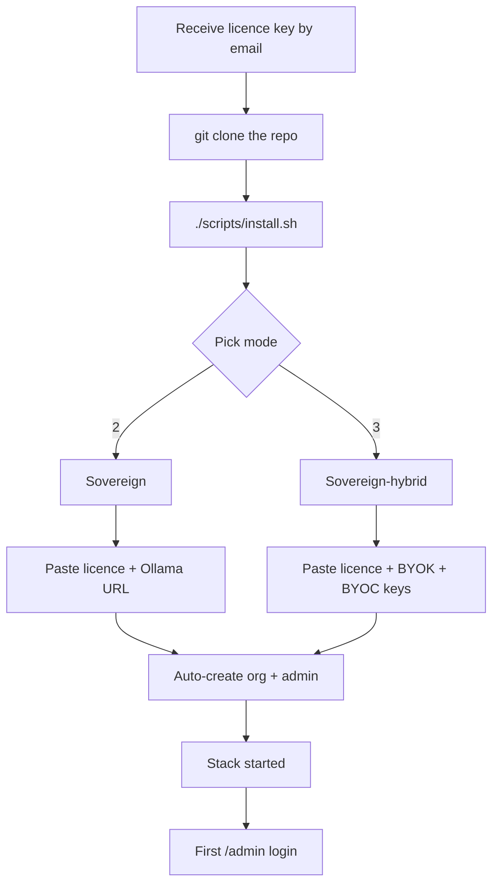

# Installation

Myeline ships with a guided installer (`scripts/install.sh`) that
asks the right questions for your chosen edition and writes your
`.env` file automatically.

Four detailed steps:

- [Server prerequisites](prerequisites.md) — CPU / RAM / disk sizing
- [Sovereign installation](sovereign.md) — air-gap on-prem
- [Sovereign-hybrid installation](sovereign-hybrid.md) — on-prem + BYOK
- [First admin login](first-login.md) — create the org, set up SSO,
  verify the overall state

## Process overview

The `install.sh` script:

1. Checks system prerequisites (Podman 4.6+, RAM ≥ 6 GB, disk ≥ 20 GB free)
2. Asks for the mode (1 / 2 / 3)
3. Asks for the licence key (cryptographic validation at boot)
4. Walks you through `.env` (mailer, AI, OAuth, backups, Pangolin
   tunnel…) category by category
5. Generates cryptographic secrets (`SECRET_KEY`,
   `SECURITY_PASSWORD_SALT`, `CLOUD_TOKEN_KEY`)
6. Builds and starts the stack via Podman
7. Runs database migrations
8. Creates the initial admin account
9. (Sovereign + hybrid) Auto-creates a default organisation and
   attaches the admin to it

Allow **10 to 20 minutes**: 5 min of questions + 5-15 min of image
pull / build depending on your bandwidth.
