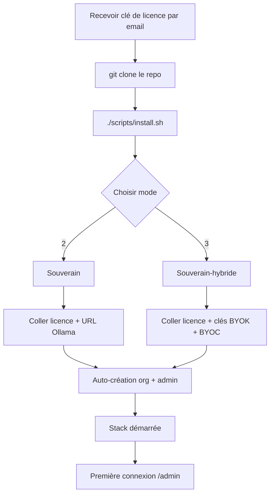

# Installation

!!! info "On-premise / Souverain — sur devis"
    Cette section couvre les installations **on-premise**, livrées dans
    le cadre d'un déploiement **sur-mesure, sur devis**. Le périmètre,
    les modèles IA et les intégrations sont calibrés avec vous. Pour la
    version hébergée (rien à installer), voir le
    [Cloud / Hébergé](../cloud/index.md) ; pour l'auto-hébergement
    gratuit, voir [Community / Self-host](../community/index.md).

Myeline est livré avec un installer guidé (`scripts/install.sh`) qui
pose les bonnes questions selon l'édition choisie et écrit votre
fichier `.env` automatiquement.

Quatre étapes détaillées :

- [Pré-requis serveur](prerequisites.md) — sizing CPU / RAM / disque
- [Installation souveraine](sovereign.md) — air-gap on-prem
- [Installation souverain-hybride](sovereign-hybrid.md) — on-prem + BYOK
- [Première connexion admin](first-login.md) — créer l'org, vérifier
  l'état général

## Vue d'ensemble du processus

Le script `install.sh` :

1. Vérifie les pré-requis système (Podman 4.6+, RAM ≥ 6 GB, disque ≥ 20 GB libres)
2. Vous demande le mode (1 / 2 / 3)
3. Vous demande la clé de licence (validation cryptographique au boot)
4. Vous guide catégorie par catégorie pour remplir le `.env` (mailer,
   IA, OAuth, backups, Pangolin tunnel…)
5. Génère les secrets cryptographiques (`SECRET_KEY`,
   `SECURITY_PASSWORD_SALT`, `CLOUD_TOKEN_KEY`)
6. Build et démarre la stack via Podman
7. Lance les migrations de base de données
8. Crée le compte administrateur initial
9. (Souverain + hybride) Crée automatiquement une organisation
   par défaut et y attache l'admin

Compter **10 à 20 minutes** : 5 minutes de questions + 5-15 minutes de
pull / build des images selon votre connexion.
