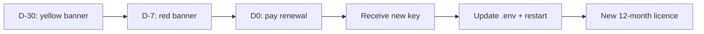

# Licence renewal

Myeline licences have a maximum duration of **12 months**. This page
covers the renewal cycle and recovery procedures in case of incident.

!!! warning "Why max 12 months?"
    **Sovereign air-gap** deployments cannot be revoked instantly
    (no network connection to push a revocation list). Short
    expirations are the only practical lever to stop usage if a
    customer doesn't renew. That's why the licence generator refuses
    durations > 12 months.

## Standard renewal cycle



### D-30: yellow alert

A yellow banner appears on **all admin pages**:

> Myeline licence expires on 6 May 2027 (15 days remaining).
> Without renewal, the app will refuse to start after that date.
> Contact hello@myeline.io to receive your new key.

Logs include a warning at boot:

```
WARNING  app.license  ⚠️  License expires in 15 days (on 2027-05-06T23:59:59Z).
```

### D-7: red alert

The banner turns red (`alert-danger`). It's your last safety net to
plan the renewal.

### D0: action

1. **Commercial side**: pay the renewal invoice received by email
2. **Technical side**: receive the new `MYE-...` key by email
   (secure channel)
3. **On the server**:
    ```bash
    # Save the previous value (just in case)
    cp .env .env.backup-$(date +%Y%m%d)
    # Edit .env
    nano .env
    # → Replace the LICENSE_KEY=MYE-... line with the new value
    # Restart
    podman-compose restart web
    # ~30 s downtime
    ```
4. **Verify**: `https://your-domain/license-info` must show the new
   expiry date

No data loss — the database and volumes are untouched.

## Emergency procedure: expired licence

If you missed the alerts and the app refuses to start:

```bash
podman-compose logs web | tail -20
# → ERROR ... LicenseError: license expired on 2027-05-06T23:59:59Z
```

### Option 1 (recommended): receive + apply new key

Same as above. If the email channel works, you're back up in ~5 min
after receipt.

### Option 2 (absolute emergency): dev-mode workaround

!!! danger "Strictly temporary use"
    This procedure disables the licence check by setting
    `FLASK_ENV=development`. It's **a 15-minute emergency patch at
    most**, never a sustainable solution. Your contractual licence
    terms require a valid licence in production.

```bash
# Edit .env
nano .env
# Change: FLASK_ENV=production → FLASK_ENV=development
podman-compose restart web
```

The app starts in "unlicensed dev" mode with a loud warning in the
logs. **As soon as you have the new key**, restore `FLASK_ENV=production`
+ the new licence and restart.

### Option 3: direct contact

If the email channel is broken (e.g. your Brevo is down + air-gap):

- Phone hello@myeline.io
- Exchange via Signal or another secure channel
- We can transfer the key as a signed file on a temporary share

## Recovering a corrupted public key

Symptom: the app refuses to start with:

```
LicenseError: public key not found at app/myeline_license_pubkey.pem
```

or:

```
RevocationListError: revocation list signature invalid — was tampered
```

Possible causes: disk corruption, bad Git operation, docker volume
incorrectly mounted.

### Fix

```bash
cd /path/to/myeline
git log --oneline app/myeline_license_pubkey.pem
# verify the file is committed
git checkout HEAD -- app/myeline_license_pubkey.pem app/myeline_license_revoked.json
podman-compose restart web
```

If you can't pull (true air-gap), ask us for the
`myeline_license_pubkey.pem` file by email (it's public, no security
risk). Drop it at `app/myeline_license_pubkey.pem` and restart.

## Why no auto-renewal?

This is intentional:

- **Sovereign air-gap**: technically impossible (no reachable API
  to ping a renewal service)
- **Hybrid**: technically possible but we prefer a human touchpoint
  at each renewal — it's the chance to review usage, adjust quotas,
  flag pricing or feature changes

## Renew before expiry

Recommended: kick off renewal at **D-45** for a comfortable margin.
Simple email to `hello@myeline.io`:

> Hi,
>
> Myeline licence renewal for ACME Corp (sovereign), expires
> 2027-05-06. Same parameters for another 12 months.
>
> Thanks.

You'll receive a quote within 24-48 business hours.

## See also

- [Licence errors](../troubleshooting/license-errors.md)
