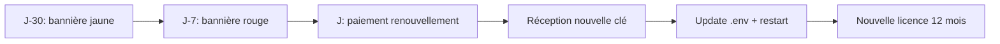

# Renouvellement de licence

Les licences Myeline ont une durée maximale de **12 mois**. Cette
section couvre le cycle de renouvellement et les procédures de
recovery en cas d'incident.

!!! warning "Pourquoi 12 mois max ?"
    Les déploiements **souverains air-gap** ne peuvent pas être
    révoqués instantanément (pas de connexion réseau pour pousser
    une revocation list). Les expirations courtes sont l'unique
    levier pratique pour cesser un usage si un client ne renouvelle
    pas. C'est pourquoi le générateur de licences refuse les durées
    > 12 mois.

## Cycle de renouvellement standard



### J-30 : alerte jaune

Une bannière jaune apparaît sur **toutes les pages admin** :

> Licence Myeline expire le 6 mai 2027 (15 jours restants).
> Sans renouvellement, l'app refusera de démarrer après cette date.
> Contactez hello@myeline.io pour recevoir votre nouvelle clé.

Les logs incluent un warning au boot :

```
WARNING  app.license  ⚠️  License expires in 15 days (on 2027-05-06T23:59:59Z).
```

### J-7 : alerte rouge

La bannière passe en rouge (`alert-danger`). C'est votre dernier
filet de sécurité pour planifier le renouvellement.

### J0 : action

1. **Côté commercial** : payer la facture de renouvellement reçue
   par email
2. **Côté technique** : recevoir la nouvelle clé `MYE-...` par email
   (canal sécurisé)
3. **Sur le serveur** :
    ```bash
    # Sauvegarder l'ancienne valeur (par précaution)
    cp .env .env.backup-$(date +%Y%m%d)
    # Éditer .env
    nano .env
    # → Remplacer la ligne LICENSE_KEY=MYE-... par la nouvelle valeur
    # Restart
    podman-compose restart web
    # ~30 s de downtime
    ```
4. **Vérifier** : `https://votre-domaine/license-info` doit afficher
   la nouvelle date d'expiration

Aucune perte de données — la base et les volumes sont intacts.

## Procédure d'urgence : licence expirée

Si vous avez raté les alertes et que l'app refuse de démarrer :

```bash
podman-compose logs web | tail -20
# → ERROR ... LicenseError: license expired on 2027-05-06T23:59:59Z
```

### Option 1 (recommandé) : recevoir + appliquer la nouvelle clé

Comme ci-dessus. Si le canal de réception (email) fonctionne, vous
êtes redémarré en ~5 min après réception.

### Option 2 (urgence absolue) : workaround dev mode

!!! danger "À usage strictement temporaire"
    Cette procédure désactive le check de licence en mettant
    `FLASK_ENV=development`. C'est **un patch d'urgence de 15 minutes
    max**, jamais une solution durable. Les conditions contractuelles
    de votre licence imposent une licence valide en production.

```bash
# Éditer .env
nano .env
# Changer : FLASK_ENV=production → FLASK_ENV=development
podman-compose restart web
```

L'app démarre en mode "unlicensed dev" avec un warning loud dans les
logs. **Dès que vous avez la nouvelle clé**, remettez
`FLASK_ENV=production` + la nouvelle licence et redémarrez.

### Option 3 : contact direct

Si le canal email est cassé (ex. votre Brevo down + air-gap) :

- Téléphone hello@myeline.io
- Échange par signal ou autre canal sécurisé
- On peut vous transmettre la clé par fichier signé sur un partage
  temporaire

## Recovery d'une clé publique corrompue

Symptôme : l'app refuse de démarrer avec :

```
LicenseError: public key not found at app/myeline_license_pubkey.pem
```

ou bien :

```
RevocationListError: revocation list signature invalid — was tampered
```

Causes possibles : disque corrompu, mauvaise manipulation Git,
docker volume mal monté.

### Solution

```bash
cd /chemin/vers/myeline
git log --oneline app/myeline_license_pubkey.pem
# vérifier que le fichier est bien committé
git checkout HEAD -- app/myeline_license_pubkey.pem app/myeline_license_revoked.json
podman-compose restart web
```

Si vous ne pouvez pas pull (vrai air-gap), demandez-nous le fichier
`myeline_license_pubkey.pem` par email (il est public, aucun risque
sécurité). Posez-le simplement à `app/myeline_license_pubkey.pem`
et redémarrez.

## Pourquoi pas d'auto-renouvellement ?

C'est volontaire :

- **Sovereign air-gap** : impossible techniquement (pas d'API
  reachable pour pinger un service de renouvellement)
- **Hybrid** : possible techniquement mais on préfère un point de
  contact humain à chaque renouvellement — c'est l'occasion de
  faire le point sur les usages, ajuster les quotas, signaler des
  changements de tarifs ou de features

## Renouveler avant l'expiration

Recommandé : initier le renouvellement à **J-45** pour avoir une
marge confortable. Email simple à `hello@myeline.io` :

> Bonjour,
>
> Renouvellement licence Myeline pour ACME Corp (sovereign), expire
> le 06/05/2027. Mêmes paramètres pour 12 mois supplémentaires.
>
> Merci.

Vous recevrez un devis dans les 24-48 h ouvrées.

## Voir aussi

- [Erreurs de licence](../troubleshooting/license-errors.md)
- [Architecture du système de licence](https://github.com/ClaraVnk/myeline-docs/blob/main/SYSTEM-DESIGN.md) (interne — sur demande)
